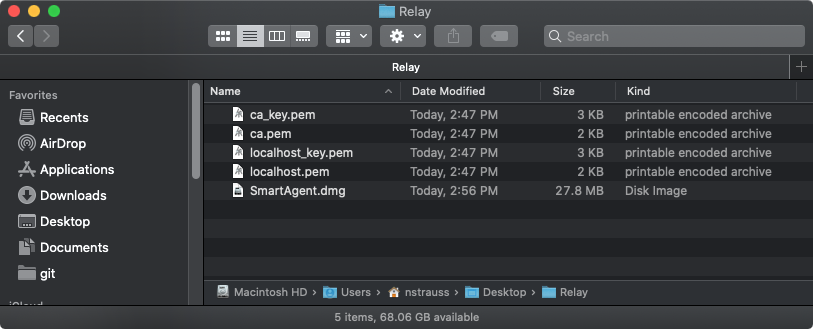

# Lightspeed Relay Smart Agent
Lightspeed's documentation only provides a DMG method to mount and install the containing package. This is an alternative package installer which takes required files from the mounted DMG and repackages. Keep in mind this is not directly supported by Lightspeed, and they may not be able to help if something goes wrong. This package has been tested on thousands of Macs without a problem. 

1. Download the latest DMG from the Relay admin portal.
2. `autopkg repo-add nstrauss-recipes`
3. `autopkg run RelaySmartAgent.pkg.recipe --key AGENT_DMG="/path/to/SmartAgent.dmg"`
4. Profit!

There is no download recipe as the URL changes on each release and targeting a DMG also allows repackaging beta or prerelease versions. LightspeedRelaySmartAgentVersioner runs the `mobilefilter` binary to get the version and was stolen from [andrewzirkel-recipes](https://github.com/autopkg/andrewzirkel-recipes/tree/master/LightspeedRelaySmartAgent). Thanks Andrew! Nothing wrong with those recipes, but they still use a DMG wrapped in a package. This recipe is a straight package alternative.

## Kextless Recipe
The kextless recipe is meant to be used with smart agent version 1.5.0 or later. It provides initial Big Sur compatibility. 1.5.0+ without the kext installed also significantly improves download speeds. There was previously an issue that bottleknecked downloads at around 50 Mbps or degraded slower connections even further. From Relay's release notes...

- Adds Big Sur compatibility by allowing the Smart Agent components to continue filtering browser requests without the use of Apple’s deprecated kernel extensions. 
- Note: Due to the deprecation of Apple’s filtering kernel extensions, the Smart Agent will only ensure filtering for applications that honor the system proxy settings.

Some applications without proxy support might not be filtered. Depending on your environment, that may be a good or bad thing.

## Kextless Recipe with Certificate Material
Due to certificate trust changes in Big Sur, it's now a requirement to install the Lightspeed CA certificate via MDM. Relay smart agent 1.6.0 no longer generates and installs a trusted root certificate using the included `makeca` utility. Customers need to get access to the utility from Lightspeed support. Running `makeca` will generate a new root certificate and supporting certificate material.

- ca_key.pem
- ca.cer
- ca.pem
- localhost_key.pem
- localhost.pem

1. Push ca.cer to Macs using MDM. Your specific MDM will have more detailed directions. With Jamf Pro this is the built-in Certificate payload. Note this certificate and the one generated by previous smart agent installs can coexist. The certificate can be pushed to endpoints before smart agent installation.
2. Create a new folder. Copy SmartAgent.dmg (1.6.0+), ca_key.pem, ca.pem, localhost_key.pem, and localhost.pem to the folder.

3. `autopkg repo-add nstrauss-recipes`
4. `autopkg run RelaySmartAgentKextlessCA.pkg.recipe --key RELAY_DIR="/path/to/Relay"
6. A new package will be created which includes certificate material installed to /usr/local/etc/
